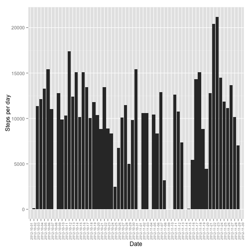
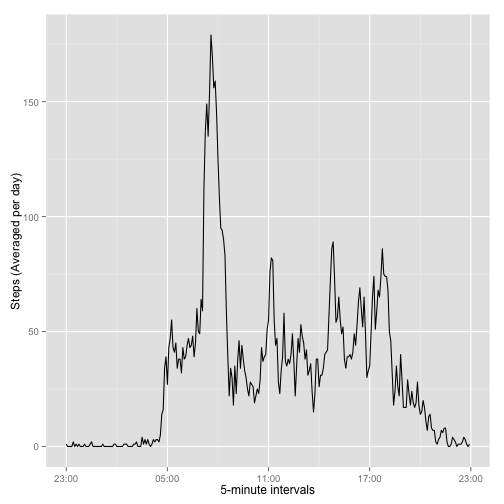
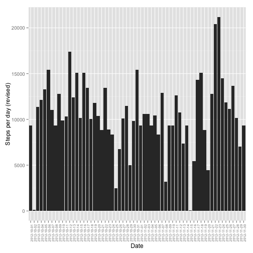
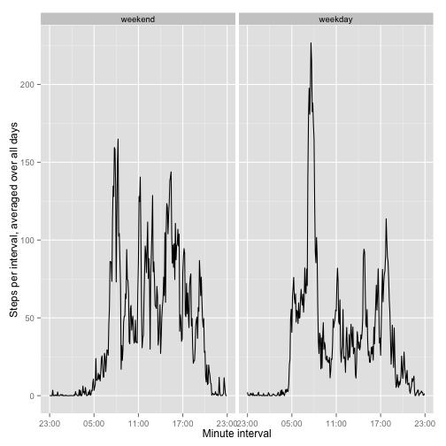

# Reproducible Research: Peer Assessment 1

## Notes


```r
## Package dependencies
# install.packages(c('stringr', 'dplyr', 'ggplot2', 'scales', 'knitr', 'chron'))

# Note 1: As some libraries overwrite the functions of others, the required libraries
# are loaded and re-loaded prior to the code chunk that requires them.

# Note 2: generated the output (figure/*, PA_template.md, etc) using:
#   library(knitr)
#   knit2html('PA1_template.Rmd')
```

# Summary of data

This assignment makes use of data from a personal activity monitoring device. This device collects data at 5 minute intervals through out the day. The data consists of two months of data from an anonymous individual collected during the months of October and November, 2012 and include the number of steps taken in 5 minute intervals each day.

The variables included in this dataset are:

  * steps: Number of steps taking in a 5-minute interval (missing values are coded as NA)
  * date: The date on which the measurement was taken in YYYY-MM-DD format
  * interval: Identifier for the 5-minute interval in which measurement was taken

The dataset is stored in a comma-separated-value (CSV) file (packed in a zipped file) and there are a total of 17,568 observations in this dataset.

Source: [rdpeng/RepData_PeerAssessment1/../README.md](https://github.com/rdpeng/RepData_PeerAssessment1/blob/master/README.md)  

# Loading and preprocessing the data

## Load the data

Original data source: [rdpeng/RepData_PeerAssessment1](https://github.com/rdpeng/RepData_PeerAssessment1/)


```r
# Data was imported by cloning rdpeng's github repo for the assignment, and unzipping the
# activity.zip data file.
if (! file.exists('activity.csv')) {
  unzip('activity.zip')
}
data <- read.csv('activity.csv')
```

## Process/transform the data ...

... (if necessary) into a format suitable for your analysis.

**A look at the existing data variables:**


```r
str(data)
```

```
## 'data.frame':	17568 obs. of  3 variables:
##  $ steps   : int  NA NA NA NA NA NA NA NA NA NA ...
##  $ date    : Factor w/ 61 levels "2012-10-01","2012-10-02",..: 1 1 1 1 1 1 1 1 1 1 ...
##  $ interval: int  0 5 10 15 20 25 30 35 40 45 ...
```

```r
head(data, n = 3); tail(data, n = 3)
```

```
##   steps       date interval
## 1    NA 2012-10-01        0
## 2    NA 2012-10-01        5
## 3    NA 2012-10-01       10
```

```
##       steps       date interval
## 17566    NA 2012-11-30     2345
## 17567    NA 2012-11-30     2350
## 17568    NA 2012-11-30     2355
```

```r
# Count NAs in data$steps for dynamic use in text.
missing_steps <- sum(is.na(data$steps))
```

Of the given variables:

- **steps**: is correctly formatted as int-type, so no processing required here. Be aware that there are **2304** missing data points (NAs) that will be dealt with later in the processing.
- **date**: the dates were automatically imported as factors, so need to be converted to a time format for correct parsing.
- **interval**: although described as identifiers in the assignment, these are in fact poorly-formatted 5-minute time of day intervals in 24-hour format. (E.g. 0 refers to midnight, or 00:00 hours; 105 is 01:05 hours, etc.). To process these, first pad the strings to four digits and then reformatted to the form **hh:mm**. Although stored as strings, these can be later converted to time objects.

Additional variables to create:

- **interval_time**: **interval** identifier converted to the time-readable format _hh:mm_.
- **datetime\_interval**: A merged variable of the given **date** and the new **interval_time** variables, stored as POSIXct type object.
- **day_kind**: a variable of one of two values, 'weekday' or 'weekend'.

Create variable interval_time (hh:mm) from interval variable:


```r
# 'stringr' for str_pad() and 'dplyr' for chaining, and other functions later on.
library('stringr')
library('dplyr')

# Pad out to 4-chars length with 0s, then insert a ':' into third position 
# so we can convert to time
data$interval_time <- str_pad(data$interval, 4, "left", pad='0') %>%
  gsub("(\\d\\d)(\\d\\d)", "\\1:\\2", . , perl=TRUE)

# Create variable datetime_interval from date and interval_time variables:
data$datetime_interval <- as.POSIXct( paste(data$date, data$interval_time), tz='UTC')
```

# Mean total number of steps taken per day:

The mean is calculated from the sum of steps (ex. NAs) divided by the number of days in the dataset whether a day includes any values or not -- i.e. 61 days.


```r
# Use n_distinct(dplyr) to count number of days
sum(data$steps, na.rm=T) / n_distinct(data$date)
```

```
## [1] 9354.23
```

## Histogram of total number of steps taken each day

See [here](http://mathcentral.uregina.ca/QQ/database/QQ.09.99/raeluck1.html) for an explanation of the difference between a bar plot and a histogram.


```r
# Select date and step variables, group by dates and sum the steps for each date
steps_by_day <- select(data, date, steps) %>% 
  group_by(date) %>%
  summarize(steps = sum(steps))

# Produce a histogram from the data in 'steps_by_day' tbl_df
library(ggplot2)
p <- ggplot(steps_by_day, aes(x=date))
p <- p + geom_histogram(aes(weight = steps))
p <- p + theme(axis.text.x = element_text( angle = 90, size = rel(0.7) ))
p <- p + ylab('Steps per day') + xlab('Date')
p
```

 

## Calculate / report the mean and median total number of steps taken per day

_Note: These averages likely do not accurately reflect the real averages as 8 days consist entirely of missing data._

Mean:

```r
# mean by day
round(mean(steps_by_day$steps, na.rm=T))
```

```
## [1] 10766
```

Median:

```r
# median by day
median(steps_by_day$steps, na.rm=T)
```

```
## [1] 10765
```

# What is the average daily activity pattern?

## Make a time series plot (i.e. type = "l") ... 

*... of the 5-minute interval (x-axis) and the average number of steps taken, averaged across all days (y-axis).*


```r
# Group and sum steps taken, dividing by number of days (61) - round the result
avg_steps_by_interval <- select(data, time=interval_time, steps) %>% 
  group_by(time) %>%
  summarize(steps = round(sum(steps, na.rm = T) / 61 ))

# Convert time strings to time objects
avg_steps_by_interval$hms <- as.POSIXct(avg_steps_by_interval$time, format="%H:%M")

# Use scale_x_datetime(ggplot2) for x-axis labels, and date_format(scales)
# to format HH:SS time strings.
library('ggplot2')
library('scales')
p <- ggplot(avg_steps_by_interval, aes(hms, steps)) + geom_line()
p <- p + scale_x_datetime(labels = date_format("%H:%M"))
p <- p + xlab("5-minute intervals") + ylab("Steps (Averaged per day)")
p
```

 

## Which 5-minute interval contains the maximum number of steps?

_... as averaged across all the days in the dataset._


```r
avg_steps_by_interval$time[
  which.max(avg_steps_by_interval$steps)
  ]
```

```
## [1] "08:35"
```


# Imputing missing values

## Calculate total number of missing values in the dataset

_i.e. the total number of rows with NAs_


```r
# Missing data for all variables (columns)
colSums(is.na(data))
```

```
##             steps              date          interval     interval_time 
##              2304                 0                 0                 0 
## datetime_interval 
##                 0
```

## Fill in all of the missing values in the dataset

_The strategy for filling missing values does not need to be sophisticated. For example, you could use the mean/median for that day, or the mean for that 5-minute interval, etc._

For some of the days, data is missing for all intervals -- so the most sensible strategy would be to fill NAs with the mean for the corresponding 5-minute interval across all days.


```r
# Create a new dataset that is equal to the original dataset but with the
# missing data filled in.

# A logical vector of missing values for variable steps
dataNA <- is.na(data$steps)

# Copy data to data2
data2 <- data

# Using the logical vector dataNA to index the missing values, replace the 
# missing value with the mean of that time-interval of all days.
for (i in which(dataNA)) {    
    data2$steps[i] = 
      avg_steps_by_interval$steps[avg_steps_by_interval$time == data2$interval_time[i]]
}

# Convert data2$steps to numeric (above converts it to character class)
data2$steps <- as.numeric(data2$steps)
```

## Make a histogram of the total number of steps taken each day


```r
# Select date and step variables, group by dates and sum the steps for each date
steps_by_day2 <- select(data2, date, steps) %>% 
  group_by(date) %>%
  summarize(steps = sum(steps))

# Produce a histogram from the data in 'steps_by_day' tbl_df
library(ggplot2)
p <- ggplot(steps_by_day2, aes(x=date))
p <- p + geom_histogram(aes(weight = steps))
p <- p + theme(axis.text.x = element_text( angle = 90, size = rel(0.7) ))
p <- p + ylab('Steps per day (revised)') + xlab('Date')
p
```

 

### Calculate and report the mean and median total number of steps taken per day.

Mean:

```r
# mean by day
round(mean(steps_by_day2$steps, na.rm=T))
```

```
## [1] 10581
```

Median:

```r
# median by day
median(steps_by_day2$steps, na.rm=T)
```

```
## [1] 10395
```

### Do these values differ from the estimates from the first part of the assignment?

These differ in that adjusted mean and median steps are lower than those with the missing data. The reason for this is that the missing data made 8 days disappear, so the earlier mean/median
calculated averaged over a smaller number of days.

Having used an average of those days with interval values to impute missing data, the average of the smaller number of days was in this calculation effectively averaged over an additional 8 days, therefore reducing the mean/median number of steps.

### What is the impact of imputing missing data on the estimates of the total daily number of steps?

As expected, the total number of steps increases when the imputed values are included.


```r
# Sum of steps for original data vs modified data
sum(data$steps, na.rm=T); sum(data2$steps, na.rm=T)
```

```
## [1] 570608
```

```
## [1] 645424
```


# Are there differences in activity patterns between weekdays and weekends?


## Create a new factor variable in the dataset ...

... with two levels – “weekday” and “weekend” indicating whether a given date is a weekday or weekend day.


```r
# Use is.weekend(chron) for logical(); convert to factor; change T/F to weekend/weekday
library(chron)
data2$day_kind <- as.factor(is.weekend(data2$date))
levels(data2$day_kind) <- list(weekend = 'TRUE', weekday = 'FALSE')
str(data2$day_kind)
```

```
##  Factor w/ 2 levels "weekend","weekday": 2 2 2 2 2 2 2 2 2 2 ...
```

## Make a panel plot containing a time series plot ...

... (i.e. type = "l") of the  5-minute interval (x-axis) and the average number of steps taken, averaged across all weekday days or weekend days (y-axis).


```r
# Count number of weekdays and number of weekend days -- used below to calculate day average
n_weekdays = n_distinct(data2$date[data2$day_kind == 'weekday'])
n_weekends = n_distinct(data2$date[data2$day_kind == 'weekend'])

# For steps taken, group first by day_kind and then by interval_time, then sum them
avg_steps_by_interval_2 <- select(data2, time=interval_time, steps, day_kind) %>% 
  group_by(day_kind, time) %>%
  summarize(steps = sum(steps, na.rm = T))

# Convert times to time objects
avg_steps_by_interval_2$time <- as.POSIXct(avg_steps_by_interval_2$time, format="%H:%M")

# Calculate average of daily steps, by weekday and by weekend for each 
# of 288 five-minute intervals
weekdays <- which(avg_steps_by_interval_2$day_kind == 'weekday')
weekends <- which(avg_steps_by_interval_2$day_kind == 'weekend')

# For each interval, seperately for weekday and weekend kinds, calculate an average number
# of steps.
avg_steps_by_interval_2$avg_steps[weekdays] <-  round(avg_steps_by_interval_2$steps[weekdays] / n_weekdays, digits = 2)
avg_steps_by_interval_2$avg_steps[weekends] <-  round(avg_steps_by_interval_2$steps[weekends] / n_weekends, digits = 2)

# Plot using ggplot2: time interval (x-axis) vs avg_steps (y-axis)
library('scales')
p <- ggplot(avg_steps_by_interval_2, aes(time, avg_steps)) + geom_line()
p <- p + scale_x_datetime(labels = date_format("%H:%M"))
p <- p + xlab("Minute interval") + ylab("Steps per interval, averaged over all days")
p <- p + facet_grid(. ~ day_kind)
p
```

 


For weekdays the activity peaks correspond strongly to working day patterns (morning and evening commutes, and lunchtime). Weekend's activity peaks are spread more evenly across the day, but begin and end later.


# Resources

The following resources were used to complete the coding and graphing aspects of this assignment:

* [Hint for defining YAML in rmarkdown documents](http://stackoverflow.com/questions/23449319/yaml-current-date-in-rmarkdown)
* [R Markdown — Dynamic Documents for R](http://rmarkdown.rstudio.com)
* [R Markdown Reference Guide](http://rmarkdown.rstudio.com/RMarkdownReferenceGuide.pdf)
* [Counting NAs in dataset](http://stackoverflow.com/a/8317303/4452372)
* [What is the difference between a bar graph and a histogram?](http://mathcentral.uregina.ca/QQ/database/QQ.09.99/raeluck1.html)
* [ggplot2 docs/ggplot](http://docs.ggplot2.org/current/ggplot.html)
* [ggplot2 docs/geom_histogram](http://docs.ggplot2.org/current/geom_histogram.html)
* [ggplot2 docs/theme](http://docs.ggplot2.org/current/theme.html)
* [ggplot2 docs/scale_datetime](http://docs.ggplot2.org/current/scale_datetime.html)
* [How does one change the levels of a factor column ...](http://stackoverflow.com/a/14635719/4452372)
